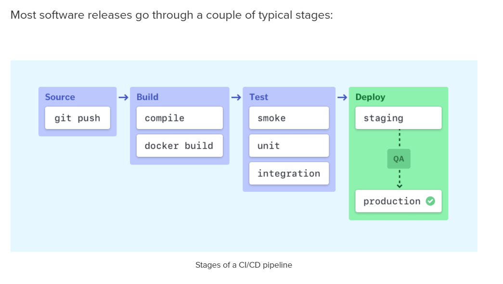
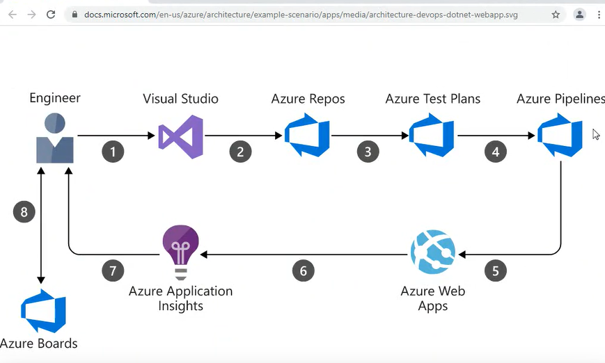

## Elements of a CI/CD pipeline
The steps that form a CI/CD pipeline are distinct subsets of tasks grouped into what is known as a **pipeline stage**. Typical pipeline stages include:

- Build - The stage where the application is compiled.
- Test - The stage where code is tested. Automation here can save both time and effort.
- Release - The stage where the application is delivered to the repository.
- Deploy - In this stage code is deployed to production.
- Validation and compliance - The steps to validate a build are determined by the needs of your organization. Image security scanning tools, like Clair, can ensure the quality of images by comparing them to known vulnerabilities (CVEs).

- Artifact is deployable component of the application and that is typically created from the build process
- Deployment groups - logical group of target machines to deploy to. When we write our build definition, we have a specific enviroment or a set of machines to deploy to. These machines themselves have agents installed on them to run tasks and go through these tasks step by step (deployment group as grouping of agents deploying an application into the defined enviroment).

